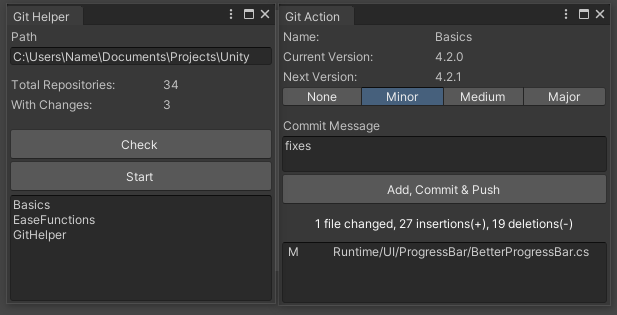



🚀 Git Multi-Repo Manager for Unity
Effortlessly manage multiple Git repositories within your Unity project.

This package streamlines your workflow by automatically detecting repositories with changes and enabling one-click commits and pushes. It also identifies Unity packages and offers intuitive version bumping tools—so you can stay focused on development, not Git gymnastics.

✨ Features
🔍 Auto-detects modified repositories

✅ Commit & push all changes with a single click

🔢 Easily increment package version numbers